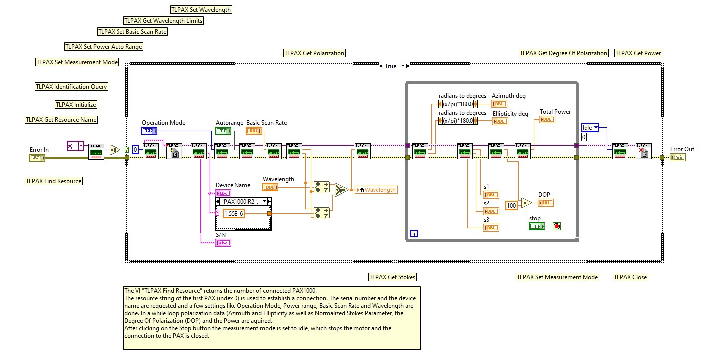

# Simple Example
Shows how to connect to the polarimeter and measure the polarization\
After installation of the PAX1000 software from the Thorlabs website, you can find more examples and subvis in the folder
C:\Program Files\National Instruments\LabVIEW xxxx\instr.lib\TLPAX
where xxxx corresponds to the LabVIEW version

Tested with Labview 2023 Q3, 64 Bit\
Thorlabs PAX1000 software version 1.4 
 
## Front Panel

## Block Diagram

