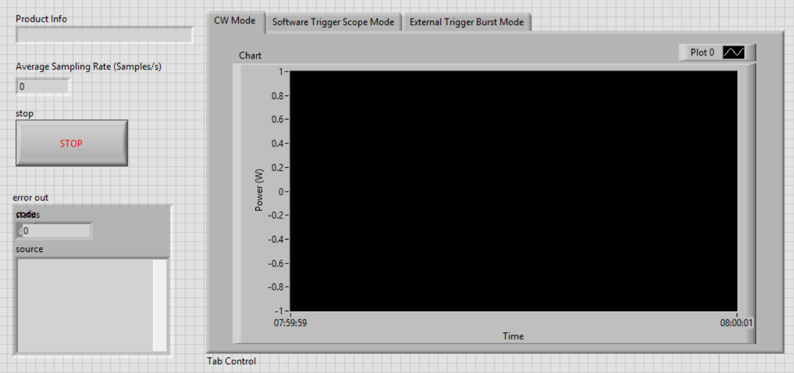
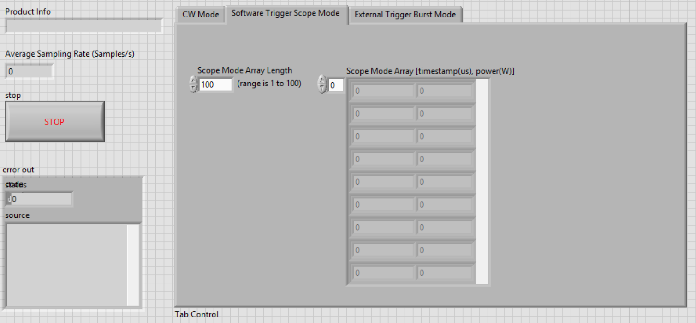
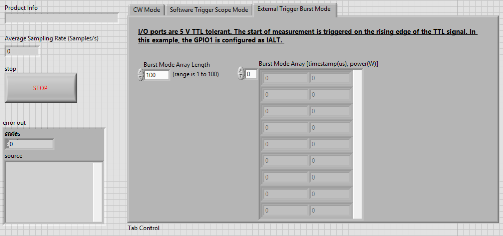
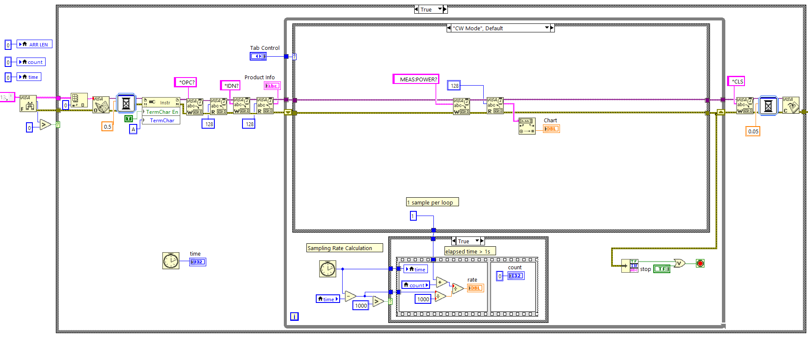
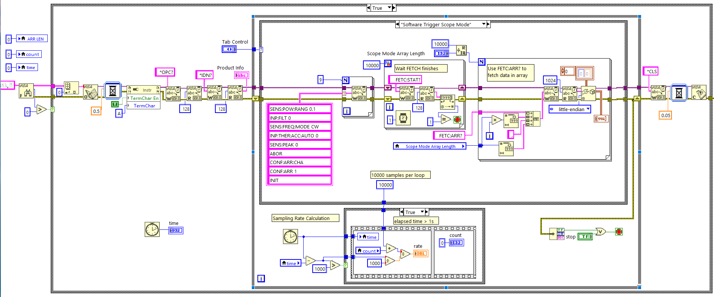
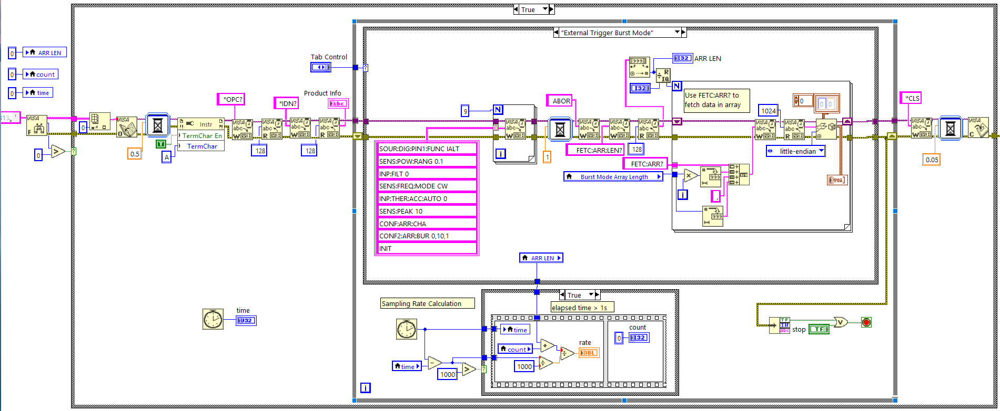

# PM100D2/D3 Power Meter: Scope and Burst Mode SCPI Example
This example shows how to connect to the PM100D2/D3 power meter and measure the power in software triggered scope mode and external triggered burst mode in SCPI commands. The basic CW mode example is also included. 

You can find the SCPI command description for every Power Meter in the  [commandDocu](../../../Python/Thorlabs%20PMxxx%20Power%20Meters/SCPI/commandDocu) folder. If Thorlabs's "Optical Parameter Monitor" software has already been installed in the PC, please switch the driver to "NI-VISA" before running the example. 
 
## Measurement Modes
 
### 1. CW Mode
In this mode, single-point measurements are executed when receiving the `MEAS:POW?` SCPI command.
* Buffer & Speed: The CW mode transfers individual data points sequentially. The maximum sampling rate is approximately 1 kHz, which is restricted by bus communication latency and data transfer overhead.

 
### 2. Software-Triggered Scope Mode
In this mode, measurements are triggered by the internal signal level of the sensor. 
* Trigger Configuration: The example code configures the software trigger level to `0`. All power readings are stored without a specific threshold.
* Buffer & Speed: The scope mode stores up to 10000 samples with given averaging at max 100 kHz (10 us) in an internal buffer.
 
### 3. External-Triggered Burst Mode
In this mode, measurements are triggered by an external TTL trigger source. **The maximum voltage is 5 V**. 
* Trigger Configuration: The example sets ExtIO1 (IO1 on the PM100D3 AUX Connector) as the external trigger input channel.
* Buffer & Speed: The scope mode stores up to 15000 samples with given averaging at max 100 kHz (10 us) in an internal buffer. 
* Hardware Compatibility Note: The PM100D2 model is not equipped with an AUX connector and therefore does not support hardware-triggered Burst Mode.
 
*Please note that in scope and burst mode, the stated 100 kHz sampling rate applies to the data captured within the instrument's internal buffer. If measurements are repeatedly fetched to the host PC in a continuous loop, the average sampling rate will be limited by the bus communication and data transfer overhead.*

Tested with LabVIEW 2023 Q3, 32 Bit
 
## Front Panel - CW Mode

## Front Panel - Scope Mode

## Front Panel - Burst Mode

 
## Block Diagram - CW Mode

## Block Diagram - Scope Mode

## Block Diagram - Burst Mode

