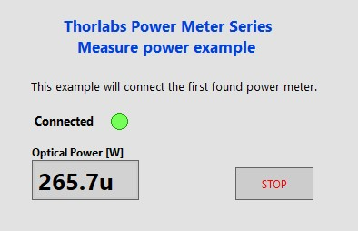
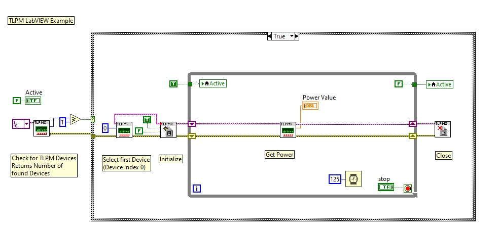

# Measure Power Sample
Shows how to connect to the Power Meter and measure the power\
After installation of the Optical Power Monitor software from the Thorlabs website, you can find more examples and subvis in the folder
C:\Program Files\National Instruments\LabVIEW xxxx\instr.lib\TLPMX
where xxxx corresponds to the LabVIEW version

Tested with Labview 2023 Q3, 64 Bit\
Thorlabs Optical Power Monitor software version 6.1 
 
## Front Panel

## Block Diagram

