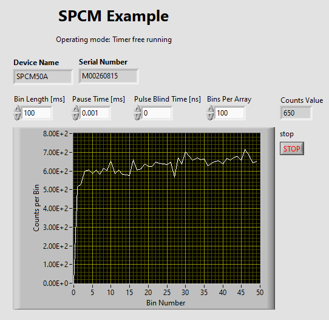

# SPCM Example
Shows how to connect to the SPCM20A(/M) or SPCM50A/M and measure photon counts in operating mode "Timer free running".

Tested with SPCM50A/M\
Labview 2023 Q3, 64 Bit\
Thorlabs Single Photon Counter software version 1.0 Build 23\
 
## Front Panel

## Block Diagram

